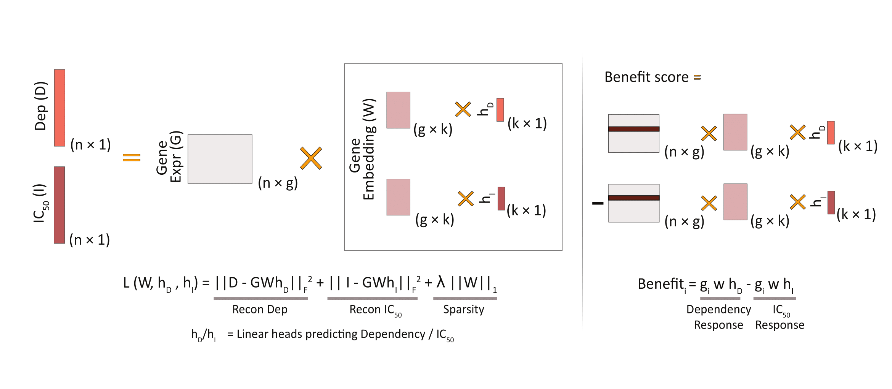

# FORGE - Factorization Of Response and Gene Essentiality

FORGE co-models drug response and target gene essentiality, enabling the stratification of promising treatment groups for targeted therapy consideration. 

### FORGE's key applications
- Provide BenefitScore to estimate treatment efficacy from basal gene expression profiles.
- Identify putative influencer genes driving treatment response

