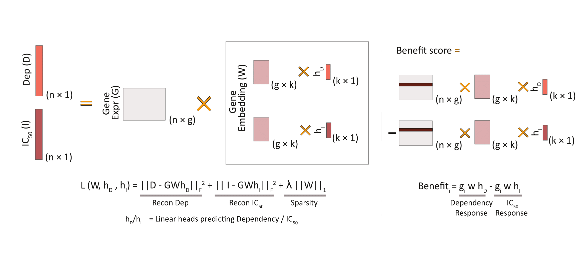

# FORGE - Factorization Of Response and Gene Essentiality



FORGE co-models drug response and target gene essentiality, enabling the stratification 
of promising treatment groups for targeted therapy consideration. 

### FORGE's key applications

- Provide BenefitScore to estimate treatment efficacy from basal gene expression profiles.
- Identify putative influencer genes driving treatment response

#### Dependencies

1. Python>=3.10
2. Numpy = 2.2.5
3. Pandas = 2.2.3
4. Scikit-learn = 1.6.1

#### Environment Setup

To ensure reproducibility, we recommend creating the project environment using **Conda** (or a compatible package manager such as Mamba).

##### Create the environment

Run the following command from the project root directory:

```bash
conda env create -f environment.yml

## Repository Structure

### Core Model Implementation
- **`forge/src/`**  
  Contains the class definitions required to instantiate and train the main **FORGE** model.  
  This directory provides the primary implementation used for all analyses reported in the manuscript.

### Data Availability
- **Raw and intermediate datasets** used in this study are publicly available at:  
  **https://doi.org/10.6084/m9.figshare.31268542**

  These include:
  - Preprocessed gene expression matrices
  - Gene dependency profiles
  - Drug response (IC50) data
  - Intermediate files generated during model training and validation

### Figure Generation and Analyses
- **`figures_publication/`**  
  Contains standalone scripts used to perform individual analyses and generate all figures included in the manuscript.  
  Each script corresponds to a specific result or figure panel and operates on the processed data outputs.

### Model Training Pipelines
- **`tests/`**  
  Includes reproducible pipelines for:
  - Training FORGE models
  - Hyperparameter optimization
  - Benchmarking against baseline and comparative models
  - Evaluating performance across multiple drug–target pairs

  These pipelines were used to generate the reported quantitative results.

---

## Reproducibility

All analyses reported in the manuscript can be reproduced by:
1. Downloading the datasets from the provided Figshare link and save in a folder './Data'
2. Instantiating the FORGE model using classes in `forge/src`
3. Running the appropriate training and evaluation pipelines from the `tests` directory
4. Generating figures using scripts in `figures_publication`

---

## Intended Use

This repository is intended for:
- Reproducibility of the published results
- Methodological transparency
- Extension of FORGE to new drug–target pairs or datasets

---

## Citation

If you use FORGE or any part of this repository in your work, please cite the associated manuscript.

---

### License

This work is licensed under the Creative Commons Attribution–NonCommercial–NoDerivatives 4.0 International (CC BY-NC-ND 4.0) License.

You are free to share — copy and redistribute the material in any medium or format — under the following terms:

Attribution — You must give appropriate credit to the original authors and source.

NonCommercial — You may not use the material for commercial purposes.

NoDerivatives — If you remix, transform, or build upon the material, you may not distribute the modified content.

For full license details, please see:
👉 https://creativecommons.org/licenses/by-nc-nd/4.0/

---

## Contact

For questions, issues, or requests related to this repository, please contact the corresponding authors listed in the manuscript.
